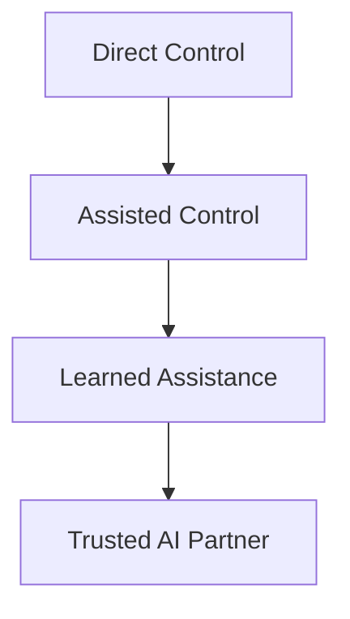

# فكرة اللعبة والقصة العامة

> [!abstract] الفكرة في سطر
> لاعب حياته اتقلبت عشان الـ AI خد شغله. بعدين يورث بيت قديم من جده، ويلاقي جواه Robot محتاج تدريب. المفارقة بقى إن نفس فكرة الـ AI اللي أذت اللاعب، هي اللي هتخليه يرجع يبني حاجة ليها معنى.

---

## الهوية الأساسية

**How To Train Your AI** لعبة عن تدريب Robot مش جاهز، جوه بيت قديم مليان رسائل وأنظمة سايبها الجد.

اللعبة مش مجرد mini-games منفصلة. كل mini-game بتعلّم الروبوت قدرة جديدة، ونتيجتها بتأثر على سلوكه بعد كده.

| العنصر | الوصف |
|---|---|
| اللاعب | شاب عنده 25 سنة، كان شغال في software، وخسر شغله بسبب AI |
| المكان | بيت قديم اللاعب ورثه من جده |
| المحرك الدرامي | رسائل الجد مش بتظهر كلها مرة واحدة، ومحتاجة الروبوت عشان تتفتح أو تتصلح |
| الرفيق الأساسي | Robot تقيل ومش كامل التدريب، اللاعب بيتحكم فيه من pod/interface |
| Progression | كل جزء في البيت بيفتح تدريب جديد وقدرة جديدة للروبوت |

---

## بداية القصة

1. اللاعب خسر شغله عشان AI استبدله.
2. وهو بيحاول يلم حياته، توصله رسالة من جده.
3. الرسالة بتقول إنه ورث بيت قديم.
4. اللاعب يروح البيت ويلاقي Robot ورسائل مسجلة.
5. الروبوت مش متدرب كفاية: حركته مش ثابتة، كاميرته بتتلخبط، وسرعته مش موثوقة.
6. اللاعب يكتشف إن الوصول لرسائل الجد محتاج تدريب الروبوت خطوة بخطوة.

> [!note] المهم هنا
> اللاعب مش بيستخدم AI جاهز. هو بيعلّمه. يعني العلاقة بتبدأ من تحكم مباشر، وبعدين تتحول تدريجيًا لشراكة.

---

## الـ Theme

> [!quote]
> الـ AI كان سبب أزمة اللاعب، بس تدريب الروبوت بيخليه يستعيد هدفه ويبني حاجة مفيدة بنفسه.

اللعبة ماشية على توتر واضح:

- اAI كقوة مخيفة بتاخد الشغل والاستقرار.
- اAI كأداة ممكن تتربى وتتظبط وتبقى مفيدة.
- اللاعب مش بيرجع زي الأول، بس بيلاقي مسار جديد.
- الروبوت مش بيتحول فجأة لعبقري. بيتعلم بالتدريج، وبأخطاء.

---

## تقدم الروبوت عبر اللعبة

| المرحلة | معنى المرحلة في اللعب |
|---|---|
| Direct Control | اللاعب بيتحكم في الروبوت بنفسه من الـ pod. الروبوت مش ثابت ومحتاج calibration |
| Assisted Control | بعد أول تدريب، الروبوت يتحسن بس لسه ممكن يغلط حسب نتيجة اللاعب |
| Learned Assistance | بعد كذا mini-game، الروبوت يبدأ يبقى أعقل في الحركة والقرارات |
| Trusted AI Partner | في آخر اللعبة، الروبوت يبقى مساعد حقيقي وصديق موثوق |

---

## Level 1 الحالي

اLevel 1 بيركز على أول مرحلة تدريب للروبوت: الحركة والتحكم والطاقة والمسار.

الفلو الحالي:

1. اللاعب يدخل البيت.
2. يلاقي الروبوت ونظام رسائل الجد.
3. يحاول يفتح الرسالة.
4. النظام يوضح إن حركة الروبوت مش reliable.
5. اللاعب يبدأ [[01 Mini Game 1 - Control Calibration|Mini-Game 1]].
6. لو فشل، يعيد التدريب.
7. لو نجح، يقدر يطبق التحسينات.
8. رسالة الجد تكمل، بس تبقى ناقصة أو corrupted.
9. اللاعب يتوجه للمخزن عشان audio card أو جزء من نظام الصوت.
10. ده يفتح [[02 Mini Game 2 - Sound Card Efficiency Trial|Mini-Game 2]].
11. بعد كده التدريب يتوسع ناحية تنظيم المعمل في [[03 Mini Game 3 - Training Signature Match|Mini-Game 3]].

---

## قاعدة تصميم كل Mini-Game

كل mini-game لازم تجاوب على سؤالين:

| السؤال | مثال |
|---|---|
| إيه سببها في القصة؟ | الروبوت مش عارف يتحرك، أو الرسالة محتاجة audio card |
| إيه المهارة اللي بتعلّمها؟ | حركة، كاميرا، سرعة، طاقة، تخطيط، ترتيب |

> [!tip] قاعدة مهمة
> لو mini-game ممتعة بس ملهاش سبب قصصي، هتحس إنها دخيلة. ولو ليها سبب قصصي بس مفيهاش learning واضح، هتبقى cutscene متخفية في شكل لعبة.

---

## ملفات الـ Mini-Games

- [[01 Mini Game 1 - Control Calibration]]
- [[02 Mini Game 2 - Sound Card Efficiency Trial]]
- [[03 Mini Game 3 - Training Signature Match]]
