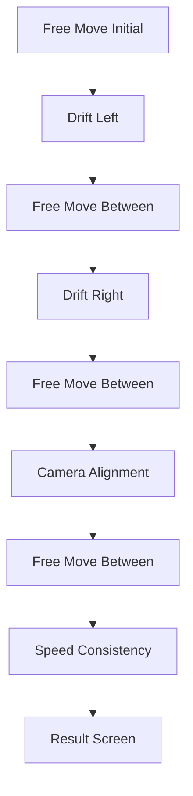

# Mini-Game 1 - Control Calibration

> [!abstract] الفكرة في سطر
> أول تدريب للروبوت. اللاعب بيظبط الحركة والكاميرا والسرعة عشان الروبوت يبقى قابل للاستخدام، بس من غير ما يبقى perfect فجأة.

---

## الدور في القصة

بعد ما اللاعب يلاقي الروبوت ويحاول يفتح رسالة الجد، يكتشف إن الروبوت مش جاهز.

مشكلته الأساسية في التحكم:

- الحركة بتعمل drift.
- الكاميرا بتتلخبط ومش بتبص في الاتجاه الصح.
- السرعة أو الـ sprint مش ثابتين.

يعني التدريب هنا مش tutorial وخلاص. ده اختبار بيحدد الروبوت هيتصرف ازاي بعد كده.

> [!note] الربط مع القصة العامة
> راجع [[00 General Story#Level 1 الحالي|Level 1 الحالي]] عشان تشوف MG1 بتفتح الطريق لـ MG2 والرسالة الـ corrupted.

---

## هدف اللاعب

اللاعب لازم يكمل 3 تحديات تدريب:

| التحدي | المهارة |
|---|---|
| Drift Handling | تصحيح انحراف الحركة |
| Camera Alignment | ضبط اتجاه الكاميرا |
| Speed Consistency | الحفاظ على سرعة ثابتة |

اللاعب لازم يوصل على الأقل لـ pass score، غالبًا `50%`، عشان يقدر يضغط `Apply Improvements` ويكمل القصة.

---

## Flow اللعب

الفواصل الحرة بين التحديات موجودة عشان اللاعب يرجع للإحساس الطبيعي قبل المشكلة اللي بعدها.

---

## Challenge 1: Drift Handling

الروبوت بيبدأ ينحرف يمين أو شمال، واللاعب لازم يعوض الانحراف ده بالاتجاه العكسي.

مثال:

| المشكلة | التصرف الصح |
|---|---|
| Drift +30 degrees | اللاعب يميل تقريبًا -30 degrees |
| Drift -30 degrees | اللاعب يميل تقريبًا +30 degrees |

الفكرة إن اللاعب يتعلم يقرا مشكلة الحركة، مش يمشي لقدام وخلاص.

> [!info] تصميم مهم
> التحدي ده environment-independent. يعني مش محتاج track أو corridor مخصوص عشان يقيس التصحيح.

---

## Challenge 2: Camera Alignment

الكاميرا بتاخد pitch غلط، واللاعب لازم يرجعها للزاوية الصح ويفضل ثابت.

اللي بيتقاس:

- سرعة التصحيح.
- متوسط خطأ زاوية الكاميرا.
- ثبات الكاميرا بعد التصحيح.

ده بيعلّم اللاعب إن الروبوت مش بس جسم بيتحرك. ده كمان عنده perception محتاجة ضبط.

---

## Challenge 3: Speed Consistency

اللعبة تضيف speed wobble أثناء التدريب، واللاعب بيتقيم على قد إيه الحركة كانت ثابتة.

الـ score بيعتمد على تذبذب السرعة. كل ما السرعة تبقى inconsistent أكتر، النتيجة تقل.

---

## Scoring

الأوزان الحالية:

| الجزء | الوزن |
|---|---:|
| Drift | 40% |
| Camera | 25% |
| Speed | 35% |

الـ tiers:

| Tier | Score |
|---|---|
| Excellent | 90-100 |
| Good | 70-89 |
| Average | 50-69 |
| Fail | أقل من 50 أو أقل من pass score |

---

## نتيجة التدريب

لو اللاعب فشل:

- `Apply Improvements` يبقى disabled.
- اللاعب لازم يعيد التدريب.
- مفيش stats بتتحدث.
- مفيش fault probabilities بتتحفظ من المحاولة دي.

لو اللاعب نجح:

- `Apply Improvements` يبقى enabled.
- اrobot stats تتحدث.
- احتمالات الأعطال المستقبلية تتحفظ.
- القصة تكمل ناحية الرسالة والمخزن و[[02 Mini Game 2 - Sound Card Efficiency Trial|MG2]].

---

## تأثير MG1 بعد ما تخلص

اMG1 مش بتمسح مشاكل الروبوت للأبد. هي بتقلل احتمالات المشاكل حسب أداء اللاعب.

| تحدي MG1 | المشكلة المستقبلية |
|---|---|
| Drift Handling | random drift fault |
| Camera Alignment | random camera pitch fault |
| Speed Consistency | random sprint cancel/block fault |

مثال واضح:

- أداء ممتاز في Drift يعني احتمال drift قليل جدًا بعد كده.
- أداء ضعيف في Camera يعني احتمال camera fault أعلى.
- أداء كويس في Speed يعني sprint faults أقل.

> [!warning] إحساس اللعبة
> الروبوت لازم يحس إنه اتحسن، بس لو اللاعب نتيجته مش perfect، يفضل فيه آثار بسيطة من التدريب الضعيف. كده اللاعب يحس إن الـ score كان له معنى.

---

## خلاصة MG1

بعد التدريب ده، اللاعب المفروض يفهم:

- إزاي يتحكم في الروبوت.
- إزاي يصحح drift.
- إزاي يظبط الكاميرا.
- إزاي يحافظ على سرعة ثابتة.
- إن تدريب الروبوت بيأثر على الـ gameplay بعد كده.
