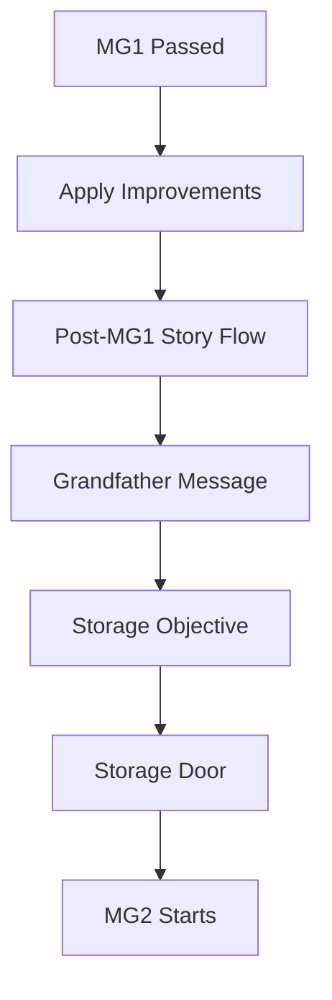

# Mini-Game 2 - Sound Card Efficiency Trial

> [!abstract] الفكرة في سطر
> بعد ما الروبوت يتظبط في الحركة، اللاعب يستخدمه عشان يوصل لـ audio card أو component في المخزن، بس الاختبار الحقيقي مش الوصول بس. الاختبار إن الروبوت يختار طريق efficient ويحافظ على الطاقة.

---

## الدور في القصة

بعد [[01 Mini Game 1 - Control Calibration|MG1]]، الروبوت بقى يقدر يتحرك بشكل أحسن. بس رسالة الجد لسه ناقصة أو corrupted.

المشكلة الجديدة إن نظام الصوت أو الرسالة محتاج audio card / component موجود في storage room.

هنا MG2 تدخل كخطوة تدريب تانية:

```text
movement calibration -> audio card / energy-path efficiency trial
```

يعني القصة بتتحرك من سؤال: **هل الروبوت يقدر يتحرك؟** لسؤال: **هل الروبوت يقدر يختار طريق صح؟**

---

## Core Idea

الروبوت لازم يوصل للهدف بأقل هدر ممكن.

مش كفاية إنه يوصل. لازم يوصل بذكاء.

المهارات المطلوبة:

- route planning.
- energy awareness.
- path efficiency.
- decision confidence.
- تجنب collisions والاختيارات الغلط.

> [!tip] الجملة اللي ماسكة تصميم MG2
> متوصلش للهدف وخلاص. اختار الطريق اللي يثبت إن الروبوت اتعلم.

---

## هدف اللاعب

اللاعب يوجه الروبوت ناحية الـ audio card / target، مع الحفاظ على الطاقة وتجنب المسارات السيئة.

الأهداف العملية:

| الهدف | معناه في اللعب |
|---|---|
| Reach Audio Card | الوصول للـ target الأساسي |
| Preserve Energy | تقليل استهلاك الطاقة |
| Avoid Waste | عدم اختيار طرق أطول من اللازم |
| Avoid Collisions | تقليل الاصطدام أو القرارات الخطرة |
| Teach Better Pathing | تحسين قدرة الروبوت على اختيار الطريق |

---

## Flow الانتقال من MG1



التفاصيل الحالية:

1. اللاعب ينجح في MG1.
2. يضغط `Apply Improvements`.
3. `MG1ToMG2FlowCoordinator` يبدأ flow ما بعد MG1.
4. رسالة الجد الـ corrupted تظهر أو تتجهز.
5. الـ objective يتغير ناحية storage room.
6. باب المخزن يودّي لـ MG2.

---

## شكل اللعب

اMG2 ممكن تبقى top-down / grid / planning style بدل direct real-time movement.

الفكرة إن اللاعب يشوف اختيارات واضحة:

| نوع الطريق | القرار المطلوب |
|---|---|
| قصير بس خطر | هل المخاطرة تستاهل؟ |
| طويل بس آمن | هل الطاقة تكفي؟ |
| موفر للطاقة | غالبًا اختيار ذكي |
| مسدود | لازم يتجنب بدري |

> [!note] تصميم المسارات
> الهدف مش maze محير. الهدف إن اللاعب يفهم ليه طريق كان كويس أو وحش.

---

## نظام الطاقة

الطاقة لازم تبقى محدودة وليها معنى.

ممكن تقل بسبب:

- movement steps.
- اtiles مكلفة في الطاقة.
- collisions.
- اturns أو قرارات غير efficient لو مطبقة.
- اختيار route أطول مع وجود طريق أوضح وأفضل.

مش مطلوب charging system كامل في MG2. الاختبار الأساسي هو كفاءة الاستخدام.

---

## Metrics المقترحة

لو اللعبة بتعرض 3 categories، الأفضل تبقى قريبة من الحالي:

| Metric | معنى التقييم | وزن مقترح |
|---|---|---:|
| Energy Efficiency | اللاعب حافظ على الطاقة قد إيه | 40% |
| Path Efficiency | الطريق المختار كان قريب من الأفضل قد إيه | 35% |
| Collision Safety / Decision Quality | قرارات آمنة وواثقة ولا لأ | 25% |

الـ stats اللي MG2 ممكن تحدثها:

```text
energyEfficiency
pathAccuracy
```

---

## قواعد النجاح والفشل

القاعدة المقترحة:

```text
finalScore >= 50 -> pass
finalScore < 50 -> fail/retry
```

لو اللاعب فشل:

- مفيش stat improvements.
- اللاعب يعيد المحاولة.
- القصة ما تكملش على أساس إن الروبوت اتعلم.

لو اللاعب نجح:

- اrobot stats الخاصة بالطاقة والمسار تتحدث.
- اللاعب يقدر يكمل القصة.
- الروبوت يبقى أوضح إنه اتعلم decision-making مش حركة بس.

---

## UI المطلوب

الـ UI لازم يوضح:

- الهدف الحالي.
- الطاقة الحالية.
- اfeedback على الطريق أو عدد الخطوات.
- تحذيرات زي Energy critical أو Collision detected.
- اresult screen فيها final score وtier.
- اretry/apply أو continue بنفس منطق MG1.

أمثلة logs مناسبة:

```text
Energy level critical
Collision detected
Path inefficiency detected
Alternative route recommended
Energy saving surface detected
Target reached: Audio Card
Route efficiency updated
Decision confidence improved
```

---

## علاقة MG2 بـ MG1

اMG1 كان عن التحكم الأساسي:

- drift.
- camera.
- speed.

اMG2 لازم ما تكررش نفس الاختبار. هي عن:

- path choice.
- energy use.
- decision quality.
- collision/path safety.

> [!warning] فصل المهارات
> لو MG2 بقت مجرد حركة تانية، هتبقى إعادة لـ MG1. لازم اللاعب يحس إن الروبوت دخل مرحلة جديدة: مش بس بيتحرك، ده بيقرر.

---

## خلاصة MG2

اMG2 بتثبت إن الروبوت بقى قادر يستخدم الحركة في مشكلة عملية: الوصول لجزء مهم من نظام رسائل الجد.

بعدها، اللعبة تقدر تنقل الروبوت لتدريبات أعقد زي تنظيم المعمل والتعامل مع objects في [[03 Mini Game 3 - Training Signature Match|MG3]].
