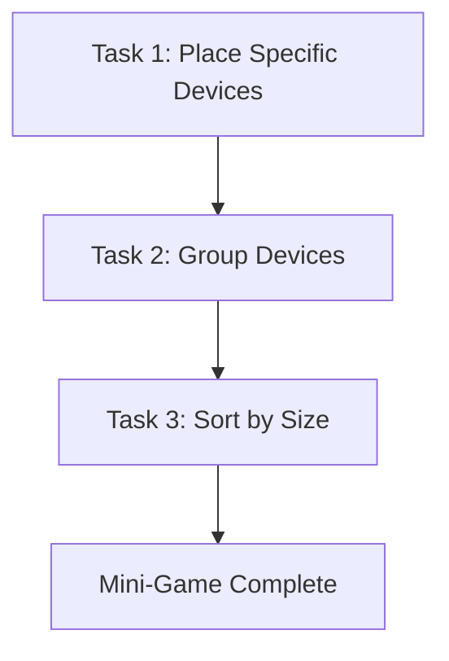

# Mini-Game 3 - Training Signature Match

> [!abstract] الفكرة في سطر
> اPuzzle جوه lab. اللاعب بيحرك الروبوت على grid مخفي، ويدفع devices للبلاطات الصح. اللعبة بتعلم spatial logic وpuzzle planning بدل الحركة الحرة.

---

## الدور في القصة

بعد تدريبات الحركة والطاقة، الروبوت يدخل مرحلة عملية أكتر: تنظيم معمل فيه أجهزة مش في مكانها.

اللاعب مش بس بيقود الروبوت. هو بيعلّمه يقرأ layout، يحرك objects، ويفهم إن كل device له مكان أو ترتيب.

> [!note] الفرق عن MG1 وMG2
> اMG1 بتسأل: هل الروبوت يقدر يتحرك؟  
> اMG2 بتسأل: هل الروبوت يقدر يختار طريق efficient؟  
> اMG3 بتسأل: هل الروبوت يقدر يخطط في مساحة فيها objects وقواعد؟

---

## Player Fantasy

- اللاعب بيدرب robot على ترتيب lab.
- الروبوت مش بيشيل objects.
- الروبوت بيقف في المكان الصح ويدفع device خطوة واحدة على الـ grid.
- النجاح جاي من قراءة المكان، مش من السرعة.
- مفيش timer أو score pressure أساسي. الضغط جاي من التخطيط.

---

## Core Rules

| القاعدة | معناها |
|---|---|
| Invisible Grid | الأرض شكلها طبيعي، بس اللعب مبني على grid |
| 4-Direction Movement | الحركة في 4 اتجاهات بس |
| One Step Push | كل push يحرك object خطوة grid واحدة |
| One Object Only | push واحد يأثر على object واحد |
| Objects Block Movement | الأجهزة نفسها obstacles |
| Solved Objects Lock | الجهاز الصح يتثبت ويفضل blocker |
| No Undo | مفيش undo، ولو deadlock يحصل reset للـ task |
| Linear Tasks | Task 2 ما يبدأش غير لما Task 1 يخلص، وهكذا |

---

## Controls

### Movement

1. اللاعب يضغط على floor tile.
2. اللعبة تحول الـ click لـ grid destination.
3. الروبوت يعمل pathfinding خلال empty tiles بس.
4. لو المكان unreachable، الحركة تترفض مع feedback.

### Pushing

1. الروبوت لازم يقف في valid push position خلف الـ object.
2. اللاعب يضغط interact.
3. الـ object يتحرك tile واحدة في اتجاه الـ push.
4. الروبوت ما يقدرش يغير الاتجاه أثناء الـ push.
5. الـ push لازم يخلص بالكامل بعد ما يبدأ.

### Reset

لو object دخل dead tile، الـ task الحالي يعمل reset كامل:

- اobjects ترجع لمكانها.
- الروبوت يرجع لمكان بداية الـ task.
- اUI يرجع لحالة الـ task.
- مفيش partial progress يكمل بالغلط.

---

## Game Structure

اMG3 فيها 3 tasks ثابتة، من غير randomization:



---

## Task 1: Place Specific Devices

**الهدف:** كل device له target slot محدد.

الفلو:

1. UI يعرض الجهاز المطلوب أو target layout.
2. اللاعب يحرك الروبوت للمكان المناسب.
3. الروبوت يدفع الجهاز ناحية البلاطة الصح.
4. البلاطة تنور أخضر لما الجهاز الصح يوصل.
5. يتكرر ده مع 3 devices.

| الصح | الغلط |
|---|---|
| الجهاز على البلاطة المطابقة | البلاطة ما تنورش والجهاز يفضل movable |

---

## Task 2: Group Devices

**الهدف:** أجهزة من نفس النوع تتجمع في group slots مناسبة.

الفلو:

1. UI يشرح المطلوب.
2. اللاعب يحدد الأجهزة المتشابهة.
3. أي device من النوع الصح ينفع يتحط على أي slot في نفس group.
4. validation يعتمد على type matching مش exact object فقط.

ده بيزود مستوى التجريد: اللاعب مش بيدور على مكان جهاز واحد، بيفهم category.

---

## Task 3: Sort by Size

**الهدف:** ترتيب devices حسب الحجم.

الفلو:

1. UI يطلب ترتيب الأجهزة من الكبير للصغير.
2. اللاعب يستخدم push planning عشان يحط كل object في ترتيبه.
3. اللعبة تتحقق من الترتيب النهائي.
4. لما الترتيب كله يبقى صح، MG3 تخلص.

> [!info] ملاحظة تصميم
> كل tasks بتحصل في نفس المشهد أو نفس مساحة اللعب، بس الفلو linear: task جديد ما يشتغلش غير لما اللي قبله يخلص.

---

## Validation Rules

- البلاطة تنور أخضر بس لما object الصح يبقى في المكان الصح.
- اnon-target tiles مسموحة كمواقف مؤقتة.
- اtarget tiles بس هي اللي بتتحسب في completion.
- اobject واحد لكل slot.
- الـ task يخلص بس لما كل required objects تبقى صح في نفس الوقت.
- اcompletion يتفحص بعد ما كل movement يوقف.
- اsolved objects تتقفل وتفضل physical blockers.

---

## Dead Tiles

اDead tile هي tile لو object وصلها، ميبقاش فيه طريقة منطقية يطلع منها.

القواعد:

- اdead tiles تأثر على pushed objects بس، مش الروبوت نفسه.
- لما deadlock يحصل، يظهر fail popup قصير.
- بعدها الـ current task يعمل reset كامل.
- كل task ممكن يحتوي dead tiles.

> [!warning] ليه ده مهم؟
> عشان MG3 puzzle planning. اللاعب لازم يفكر قبل الـ push، عشان push غلط ممكن يقفل الحل.

---

## UI المطلوب

الـ UI لازم يكون واضح ومش يخبي منطق الـ puzzle:

- current task name.
- تعليمات قصيرة.
- full target layout.
- اdevice references أو images لو محتاجة.
- completion popup.
- اfail popup عند deadlock/reset.

---

## State Flow

الحالات العامة:

```text
Idle -> Task 1 -> Task 2 -> Task 3 -> Complete
```

داخل كل task:

```text
Waiting for input
Pathfinding
Moving
Ready to push
Pushing
Settling
Checking completion
Resetting
```

---

## Edge Cases مهمة

| الحالة | السلوك المتوقع |
|---|---|
| الضغط على unreachable tile | مفيش حركة + feedback |
| أثناء الـ Push | الروبوت ما يقبلش حركة جديدة |
| الروبوت مش في push position صح | interact ما يبدأش push |
| Wrong object on slot | البلاطة تفضل unlit والجهاز movable |
| Correct object on slot | الجهاز يتقفل والبلاطة تنور |
| Reset | يرجع objects والروبوت والـ UI من غير partial progress |
| Completion | يحصل بعد settle delay عشان مفيش false check |

---

## خلاصة MG3

اMG3 بتحول الروبوت من مجرد جسم بيتحرك لجسم بيحل spatial problems.

اللاعب بيتعلم يخطط:

- يقف فين قبل ما يدفع.
- يدفع أنهي object الأول.
- يتجنب deadlocks.
- يقرأ target layout.
- يستخدم grid rules حتى لو الأرض شكلها عادي.

النتيجة النهائية: المعمل يبقى منظم، والروبوت يثبت إنه بدأ يفهم planning مش بس تنفيذ أوامر.
