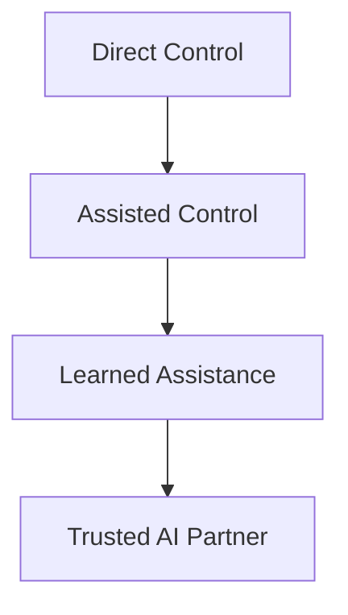
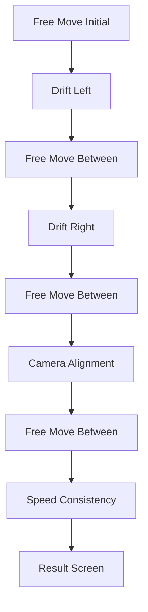
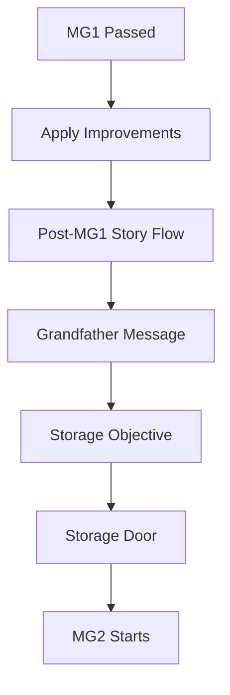
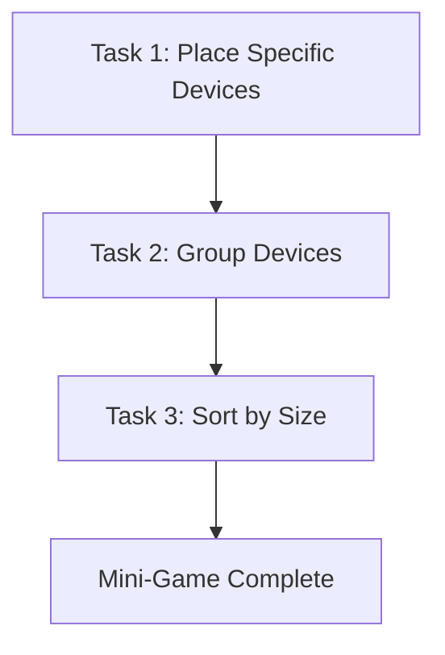
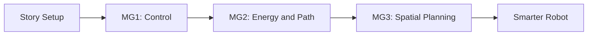

# How To Train Your AI - التصميم الكامل للقصة والـ Mini-Games

> [!abstract] الفكرة في سطر
> لاعب خسر شغله بسبب الـ AI، وبعدها يورث بيت قديم من جده ويلاقي Robot محتاج تدريب. اللعبة كلها ماشية على إن اللاعب يعلّم الروبوت خطوة بخطوة، وكل mini-game تفتح قدرة جديدة وتزق القصة لقدام.

---

## فهرس الملف

- [[#1. القصة العامة]]
- [[#2. Mini-Game 1 - Control Calibration]]
- [[#3. Mini-Game 2 - Sound Card Efficiency Trial]]
- [[#4. Mini-Game 3 - Training Signature Match]]
- [[#5. الخلاصة العامة]]

---

# 1. القصة العامة

## الهوية الأساسية

**How To Train Your AI** لعبة عن تدريب Robot مش جاهز، جوه بيت قديم مليان رسائل وأنظمة سايبها الجد.

اللعبة مش مجرد mini-games منفصلة. كل mini-game بتعلّم الروبوت قدرة جديدة، ونتيجتها بتأثر على سلوكه بعد كده.

| العنصر | الوصف |
|---|---|
| اللاعب | شاب عنده 25 سنة، كان شغال في software، وخسر شغله بسبب AI |
| المكان | بيت قديم اللاعب ورثه من جده |
| المحرك الدرامي | رسائل الجد مش بتظهر كلها مرة واحدة، ومحتاجة الروبوت عشان تتفتح أو تتصلح |
| الرفيق الأساسي | Robot تقيل ومش كامل التدريب، اللاعب بيتحكم فيه من pod/interface |
| Progression | كل جزء في البيت بيفتح تدريب جديد وقدرة جديدة للروبوت |

---

## بداية القصة

1. اللاعب خسر شغله عشان AI استبدله.
2. وهو بيحاول يلم حياته، توصله رسالة من جده.
3. الرسالة بتقول إنه ورث بيت قديم.
4. اللاعب يروح البيت ويلاقي Robot ورسائل مسجلة.
5. الروبوت مش متدرب كفاية: حركته مش ثابتة، كاميرته بتتلخبط، وسرعته مش موثوقة.
6. اللاعب يكتشف إن الوصول لرسائل الجد محتاج تدريب الروبوت خطوة بخطوة.

> [!note] المهم هنا
> اللاعب مش بيستخدم AI جاهز. هو بيعلّمه. يعني العلاقة بتبدأ من تحكم مباشر، وبعدين تتحول تدريجيًا لشراكة.

---

## الـ Theme

> [!quote]
> الـ AI كان سبب أزمة اللاعب، بس تدريب الروبوت بيخليه يستعيد هدفه ويبني حاجة مفيدة بنفسه.

اللعبة ماشية على توتر واضح:

- الـ AI كقوة مخيفة بتاخد الشغل والاستقرار.
- الـ AI كأداة ممكن تتربى وتتظبط وتبقى مفيدة.
- اللاعب مش بيرجع زي الأول، بس بيلاقي مسار جديد.
- الروبوت مش بيتحول فجأة لعبقري. بيتعلم بالتدريج، وبأخطاء.

---

## تقدم الروبوت عبر اللعبة



| المرحلة | معنى المرحلة في اللعب |
|---|---|
| Direct Control | اللاعب بيتحكم في الروبوت بنفسه من الـ pod. الروبوت مش ثابت ومحتاج calibration |
| Assisted Control | بعد أول تدريب، الروبوت يتحسن بس لسه ممكن يغلط حسب نتيجة اللاعب |
| Learned Assistance | بعد كذا mini-game، الروبوت يبدأ يبقى أعقل في الحركة والقرارات |
| Trusted AI Partner | في آخر اللعبة، الروبوت يبقى مساعد حقيقي وصديق موثوق |

---

## Level 1 الحالي

Level 1 بيركز على أول مرحلة تدريب للروبوت: الحركة والتحكم والطاقة والمسار.

الفلو الحالي:

1. اللاعب يدخل البيت.
2. يلاقي الروبوت ونظام رسائل الجد.
3. يحاول يفتح الرسالة.
4. النظام يوضح إن حركة الروبوت مش reliable.
5. اللاعب يبدأ Mini-Game 1.
6. لو فشل، يعيد التدريب.
7. لو نجح، يقدر يطبق التحسينات.
8. رسالة الجد تكمل، بس تبقى ناقصة أو corrupted.
9. اللاعب يتوجه للمخزن عشان audio card أو جزء من نظام الصوت.
10. ده يفتح Mini-Game 2.
11. بعد كده التدريب يتوسع ناحية تنظيم المعمل في Mini-Game 3.

---

## قاعدة تصميم كل Mini-Game

كل mini-game لازم تجاوب على سؤالين:

| السؤال | مثال |
|---|---|
| إيه سببها في القصة؟ | الروبوت مش عارف يتحرك، أو الرسالة محتاجة audio card |
| إيه المهارة اللي بتعلّمها؟ | حركة، كاميرا، سرعة، طاقة، تخطيط، ترتيب |

> [!tip] قاعدة مهمة
> لو mini-game ممتعة بس ملهاش سبب قصصي، هتحس إنها دخيلة. ولو ليها سبب قصصي بس مفيهاش learning واضح، هتبقى cutscene متخفية في شكل لعبة.

---

# 2. Mini-Game 1 - Control Calibration

> [!abstract] الفكرة في سطر
> أول تدريب للروبوت. اللاعب بيظبط الحركة والكاميرا والسرعة عشان الروبوت يبقى قابل للاستخدام، بس من غير ما يبقى perfect فجأة.

---

## الدور في القصة

بعد ما اللاعب يلاقي الروبوت ويحاول يفتح رسالة الجد، يكتشف إن الروبوت مش جاهز.

مشكلته الأساسية في التحكم:

- الحركة بتعمل drift.
- الكاميرا بتتلخبط ومش بتبص في الاتجاه الصح.
- السرعة أو الـ sprint مش ثابتين.

يعني التدريب هنا مش tutorial وخلاص. ده اختبار بيحدد الروبوت هيتصرف ازاي بعد كده.

---

## هدف اللاعب

اللاعب لازم يكمل 3 تحديات تدريب:

| التحدي | المهارة |
|---|---|
| Drift Handling | تصحيح انحراف الحركة |
| Camera Alignment | ضبط اتجاه الكاميرا |
| Speed Consistency | الحفاظ على سرعة ثابتة |

اللاعب لازم يوصل على الأقل لـ pass score، غالبًا `50%`، عشان يقدر يضغط `Apply Improvements` ويكمل القصة.

---

## Flow اللعب



الفواصل الحرة بين التحديات موجودة عشان اللاعب يرجع للإحساس الطبيعي قبل المشكلة اللي بعدها.

---

## Challenge 1: Drift Handling

الروبوت بيبدأ ينحرف يمين أو شمال، واللاعب لازم يعوض الانحراف ده بالاتجاه العكسي.

| المشكلة | التصرف الصح |
|---|---|
| Drift +30 degrees | اللاعب يميل تقريبًا -30 degrees |
| Drift -30 degrees | اللاعب يميل تقريبًا +30 degrees |

الفكرة إن اللاعب يتعلم يقرا مشكلة الحركة، مش يمشي لقدام وخلاص.

> [!info] تصميم مهم
> التحدي ده environment-independent. يعني مش محتاج track أو corridor مخصوص عشان يقيس التصحيح.

---

## Challenge 2: Camera Alignment

الكاميرا بتاخد pitch غلط، واللاعب لازم يرجعها للزاوية الصح ويفضل ثابت.

اللي بيتقاس:

- سرعة التصحيح.
- متوسط خطأ زاوية الكاميرا.
- ثبات الكاميرا بعد التصحيح.

ده بيعلّم اللاعب إن الروبوت مش بس جسم بيتحرك. ده كمان عنده perception محتاجة ضبط.

---

## Challenge 3: Speed Consistency

اللعبة تضيف speed wobble أثناء التدريب، واللاعب بيتقيم على قد إيه الحركة كانت ثابتة.

الـ score بيعتمد على تذبذب السرعة. كل ما السرعة تبقى inconsistent أكتر، النتيجة تقل.

---

## Scoring

| الجزء | الوزن |
|---|---:|
| Drift | 40% |
| Camera | 25% |
| Speed | 35% |

| Tier | Score |
|---|---|
| Excellent | 90-100 |
| Good | 70-89 |
| Average | 50-69 |
| Fail | أقل من 50 أو أقل من pass score |

---

## نتيجة التدريب

لو اللاعب فشل:

- `Apply Improvements` يبقى disabled.
- اللاعب لازم يعيد التدريب.
- مفيش stats بتتحدث.
- مفيش fault probabilities بتتحفظ من المحاولة دي.

لو اللاعب نجح:

- `Apply Improvements` يبقى enabled.
- robot stats تتحدث.
- احتمالات الأعطال المستقبلية تتحفظ.
- القصة تكمل ناحية الرسالة والمخزن وMG2.

---

## تأثير MG1 بعد ما تخلص

MG1 مش بتمسح مشاكل الروبوت للأبد. هي بتقلل احتمالات المشاكل حسب أداء اللاعب.

| تحدي MG1 | المشكلة المستقبلية |
|---|---|
| Drift Handling | random drift fault |
| Camera Alignment | random camera pitch fault |
| Speed Consistency | random sprint cancel/block fault |

مثال واضح:

- أداء ممتاز في Drift يعني احتمال drift قليل جدًا بعد كده.
- أداء ضعيف في Camera يعني احتمال camera fault أعلى.
- أداء كويس في Speed يعني sprint faults أقل.

> [!warning] إحساس اللعبة
> الروبوت لازم يحس إنه اتحسن، بس لو اللاعب نتيجته مش perfect، يفضل فيه آثار بسيطة من التدريب الضعيف. كده اللاعب يحس إن الـ score كان له معنى.

---

## خلاصة MG1

بعد التدريب ده، اللاعب المفروض يفهم:

- إزاي يتحكم في الروبوت.
- إزاي يصحح drift.
- إزاي يظبط الكاميرا.
- إزاي يحافظ على سرعة ثابتة.
- إن تدريب الروبوت بيأثر على الـ gameplay بعد كده.

---

# 3. Mini-Game 2 - Sound Card Efficiency Trial

> [!abstract] الفكرة في سطر
> بعد ما الروبوت يتظبط في الحركة، اللاعب يستخدمه عشان يوصل لـ audio card أو component في المخزن، بس الاختبار الحقيقي مش الوصول بس. الاختبار إن الروبوت يختار طريق efficient ويحافظ على الطاقة.

---

## الدور في القصة

بعد MG1، الروبوت بقى يقدر يتحرك بشكل أحسن. بس رسالة الجد لسه ناقصة أو corrupted.

المشكلة الجديدة إن نظام الصوت أو الرسالة محتاج audio card / component موجود في storage room.

هنا MG2 تدخل كخطوة تدريب تانية:

```text
movement calibration -> audio card / energy-path efficiency trial
```

يعني القصة بتتحرك من سؤال: **هل الروبوت يقدر يتحرك؟** لسؤال: **هل الروبوت يقدر يختار طريق صح؟**

---

## Core Idea

الروبوت لازم يوصل للهدف بأقل هدر ممكن.

مش كفاية إنه يوصل. لازم يوصل بذكاء.

المهارات المطلوبة:

- route planning.
- energy awareness.
- path efficiency.
- decision confidence.
- تجنب collisions والاختيارات الغلط.

> [!tip] الجملة اللي ماسكة تصميم MG2
> متوصلش للهدف وخلاص. اختار الطريق اللي يثبت إن الروبوت اتعلم.

---

## هدف اللاعب

اللاعب يوجه الروبوت ناحية الـ audio card / target، مع الحفاظ على الطاقة وتجنب المسارات السيئة.

| الهدف | معناه في اللعب |
|---|---|
| Reach Audio Card | الوصول للـ target الأساسي |
| Preserve Energy | تقليل استهلاك الطاقة |
| Avoid Waste | عدم اختيار طرق أطول من اللازم |
| Avoid Collisions | تقليل الاصطدام أو القرارات الخطرة |
| Teach Better Pathing | تحسين قدرة الروبوت على اختيار الطريق |

---

## Flow الانتقال من MG1



التفاصيل الحالية:

1. اللاعب ينجح في MG1.
2. يضغط `Apply Improvements`.
3. `MG1ToMG2FlowCoordinator` يبدأ flow ما بعد MG1.
4. رسالة الجد الـ corrupted تظهر أو تتجهز.
5. الـ objective يتغير ناحية storage room.
6. باب المخزن يودّي لـ MG2.

---

## شكل اللعب

MG2 ممكن تبقى top-down / grid / planning style بدل direct real-time movement.

الفكرة إن اللاعب يشوف اختيارات واضحة:

| نوع الطريق | القرار المطلوب |
|---|---|
| قصير بس خطر | هل المخاطرة تستاهل؟ |
| طويل بس آمن | هل الطاقة تكفي؟ |
| موفر للطاقة | غالبًا اختيار ذكي |
| مسدود | لازم يتجنب بدري |

> [!note] تصميم المسارات
> الهدف مش maze محير. الهدف إن اللاعب يفهم ليه طريق كان كويس أو وحش.

---

## نظام الطاقة

الطاقة لازم تبقى محدودة وليها معنى.

ممكن تقل بسبب:

- movement steps.
- tiles مكلفة في الطاقة.
- collisions.
- turns أو قرارات غير efficient لو مطبقة.
- اختيار route أطول مع وجود طريق أوضح وأفضل.

مش مطلوب charging system كامل في MG2. الاختبار الأساسي هو كفاءة الاستخدام.

---

## Metrics المقترحة

لو اللعبة بتعرض 3 categories، الأفضل تبقى قريبة من الحالي:

| Metric | معنى التقييم | وزن مقترح |
|---|---|---:|
| Energy Efficiency | اللاعب حافظ على الطاقة قد إيه | 40% |
| Path Efficiency | الطريق المختار كان قريب من الأفضل قد إيه | 35% |
| Collision Safety / Decision Quality | قرارات آمنة وواثقة ولا لأ | 25% |

الـ stats اللي MG2 ممكن تحدثها:

```text
energyEfficiency
pathAccuracy
decisionConfidence
```

---

## قواعد النجاح والفشل

```text
finalScore >= 50 -> pass
finalScore < 50 -> fail/retry
```

لو اللاعب فشل:

- مفيش stat improvements.
- اللاعب يعيد المحاولة.
- القصة ما تكملش على أساس إن الروبوت اتعلم.

لو اللاعب نجح:

- robot stats الخاصة بالطاقة والمسار تتحدث.
- اللاعب يقدر يكمل القصة.
- الروبوت يبقى أوضح إنه اتعلم decision-making مش حركة بس.

---

## UI المطلوب

الـ UI لازم يوضح:

- الهدف الحالي.
- الطاقة الحالية.
- feedback على الطريق أو عدد الخطوات.
- تحذيرات زي Energy critical أو Collision detected.
- result screen فيها final score وtier.
- retry/apply أو continue بنفس منطق MG1.

أمثلة logs مناسبة:

```text
Energy level critical
Collision detected
Path inefficiency detected
Alternative route recommended
Energy saving surface detected
Target reached: Audio Card
Route efficiency updated
Decision confidence improved
```

---

## علاقة MG2 بـ MG1

MG1 كان عن التحكم الأساسي:

- drift.
- camera.
- speed.

MG2 لازم ما تكررش نفس الاختبار. هي عن:

- path choice.
- energy use.
- decision quality.
- collision/path safety.

> [!warning] فصل المهارات
> لو MG2 بقت مجرد حركة تانية، هتبقى إعادة لـ MG1. لازم اللاعب يحس إن الروبوت دخل مرحلة جديدة: مش بس بيتحرك، ده بيقرر.

---

## خلاصة MG2

MG2 بتثبت إن الروبوت بقى قادر يستخدم الحركة في مشكلة عملية: الوصول لجزء مهم من نظام رسائل الجد.

بعدها، اللعبة تقدر تنقل الروبوت لتدريبات أعقد زي تنظيم المعمل والتعامل مع objects في MG3.

---

# 4. Mini-Game 3 - Training Signature Match

> [!abstract] الفكرة في سطر
> Puzzle جوه lab. اللاعب بيحرك الروبوت على grid مخفي، ويدفع devices للبلاطات الصح. اللعبة بتعلم spatial logic وpuzzle planning بدل الحركة الحرة.

---

## الدور في القصة

بعد تدريبات الحركة والطاقة، الروبوت يدخل مرحلة عملية أكتر: تنظيم معمل فيه أجهزة مش في مكانها.

اللاعب مش بس بيقود الروبوت. هو بيعلّمه يقرأ layout، يحرك objects، ويفهم إن كل device له مكان أو ترتيب.

> [!note] الفرق عن MG1 وMG2
> MG1 بتسأل: هل الروبوت يقدر يتحرك؟  
> MG2 بتسأل: هل الروبوت يقدر يختار طريق efficient؟  
> MG3 بتسأل: هل الروبوت يقدر يخطط في مساحة فيها objects وقواعد؟

---

## Player Fantasy

- اللاعب بيدرب robot على ترتيب lab.
- الروبوت مش بيشيل objects.
- الروبوت بيقف في المكان الصح ويدفع device خطوة واحدة على الـ grid.
- النجاح جاي من قراءة المكان، مش من السرعة.
- مفيش timer أو score pressure أساسي. الضغط جاي من التخطيط.

---

## Core Rules

| القاعدة | معناها |
|---|---|
| Invisible Grid | الأرض شكلها طبيعي، بس اللعب مبني على grid |
| 4-Direction Movement | الحركة في 4 اتجاهات بس |
| One Step Push | كل push يحرك object خطوة grid واحدة |
| One Object Only | push واحد يأثر على object واحد |
| Objects Block Movement | الأجهزة نفسها obstacles |
| Solved Objects Lock | الجهاز الصح يتثبت ويفضل blocker |
| No Undo | مفيش undo، ولو deadlock يحصل reset للـ task |
| Linear Tasks | Task 2 ما يبدأش غير لما Task 1 يخلص، وهكذا |

---

## Controls

### Movement

1. اللاعب يضغط على floor tile.
2. اللعبة تحول الـ click لـ grid destination.
3. الروبوت يعمل pathfinding خلال empty tiles بس.
4. لو المكان unreachable، الحركة تترفض مع feedback.

### Pushing

1. الروبوت لازم يقف في valid push position خلف الـ object.
2. اللاعب يضغط interact.
3. الـ object يتحرك tile واحدة في اتجاه الـ push.
4. الروبوت ما يقدرش يغير الاتجاه أثناء الـ push.
5. الـ push لازم يخلص بالكامل بعد ما يبدأ.

### Reset

لو object دخل dead tile، الـ task الحالي يعمل reset كامل:

- objects ترجع لمكانها.
- الروبوت يرجع لمكان بداية الـ task.
- UI يرجع لحالة الـ task.
- مفيش partial progress يكمل بالغلط.

---

## Game Structure

MG3 فيها 3 tasks ثابتة، من غير randomization:



---

## Task 1: Place Specific Devices

**الهدف:** كل device له target slot محدد.

الفلو:

1. UI يعرض الجهاز المطلوب أو target layout.
2. اللاعب يحرك الروبوت للمكان المناسب.
3. الروبوت يدفع الجهاز ناحية البلاطة الصح.
4. البلاطة تنور أخضر لما الجهاز الصح يوصل.
5. يتكرر ده مع 3 devices.

| الصح | الغلط |
|---|---|
| الجهاز على البلاطة المطابقة | البلاطة ما تنورش والجهاز يفضل movable |

---

## Task 2: Group Devices

**الهدف:** أجهزة من نفس النوع تتجمع في group slots مناسبة.

الفلو:

1. UI يشرح المطلوب.
2. اللاعب يحدد الأجهزة المتشابهة.
3. أي device من النوع الصح ينفع يتحط على أي slot في نفس group.
4. validation يعتمد على type matching مش exact object فقط.

ده بيزود مستوى التجريد: اللاعب مش بيدور على مكان جهاز واحد، بيفهم category.

---

## Task 3: Sort by Size

**الهدف:** ترتيب devices حسب الحجم.

الفلو:

1. UI يطلب ترتيب الأجهزة من الكبير للصغير.
2. اللاعب يستخدم push planning عشان يحط كل object في ترتيبه.
3. اللعبة تتحقق من الترتيب النهائي.
4. لما الترتيب كله يبقى صح، MG3 تخلص.

> [!info] ملاحظة تصميم
> كل tasks بتحصل في نفس المشهد أو نفس مساحة اللعب، بس الفلو linear: task جديد ما يشتغلش غير لما اللي قبله يخلص.

---

## Validation Rules

- البلاطة تنور أخضر بس لما object الصح يبقى في المكان الصح.
- non-target tiles مسموحة كمواقف مؤقتة.
- target tiles بس هي اللي بتتحسب في completion.
- object واحد لكل slot.
- الـ task يخلص بس لما كل required objects تبقى صح في نفس الوقت.
- completion يتفحص بعد ما كل movement يوقف.
- solved objects تتقفل وتفضل physical blockers.

---

## Dead Tiles

Dead tile هي tile لو object وصلها، ميبقاش فيه طريقة منطقية يطلع منها.

القواعد:

- dead tiles تأثر على pushed objects بس، مش الروبوت نفسه.
- لما deadlock يحصل، يظهر fail popup قصير.
- بعدها الـ current task يعمل reset كامل.
- كل task ممكن يحتوي dead tiles.

> [!warning] ليه ده مهم؟
> عشان MG3 puzzle planning. اللاعب لازم يفكر قبل الـ push، عشان push غلط ممكن يقفل الحل.

---

## UI المطلوب

الـ UI لازم يكون واضح ومش يخبي منطق الـ puzzle:

- current task name.
- تعليمات قصيرة.
- full target layout.
- device references أو images لو محتاجة.
- completion popup.
- fail popup عند deadlock/reset.

---

## State Flow

الحالات العامة:

```text
Idle -> Task 1 -> Task 2 -> Task 3 -> Complete
```

داخل كل task:

```text
Waiting for input
Pathfinding
Moving
Ready to push
Pushing
Settling
Checking completion
Resetting
```

---

## Edge Cases مهمة

| الحالة | السلوك المتوقع |
|---|---|
| الضغط على unreachable tile | مفيش حركة + feedback |
| أثناء الـ Push | الروبوت ما يقبلش حركة جديدة |
| الروبوت مش في push position صح | interact ما يبدأش push |
| Wrong object on slot | البلاطة تفضل unlit والجهاز movable |
| Correct object on slot | الجهاز يتقفل والبلاطة تنور |
| Reset | يرجع objects والروبوت والـ UI من غير partial progress |
| Completion | يحصل بعد settle delay عشان مفيش false check |

---

## خلاصة MG3

MG3 بتحول الروبوت من مجرد جسم بيتحرك لجسم بيحل spatial problems.

اللاعب بيتعلم يخطط:

- يقف فين قبل ما يدفع.
- يدفع أنهي object الأول.
- يتجنب deadlocks.
- يقرأ target layout.
- يستخدم grid rules حتى لو الأرض شكلها عادي.

النتيجة النهائية: المعمل يبقى منظم، والروبوت يثبت إنه بدأ يفهم planning مش بس تنفيذ أوامر.

---

# 5. الخلاصة العامة

اللعبة كلها مبنية على progression واضح:



كل mini-game بتزود طبقة جديدة:

| المرحلة | اللي الروبوت بيتعلمه |
|---|---|
| MG1 | الحركة، الكاميرا، السرعة |
| MG2 | اختيار الطريق والطاقة والقرارات |
| MG3 | التخطيط المكاني وتحريك objects حسب قواعد |

اللاعب يبدأ وهو متضرر من AI، بس يلاقي نفسه بيدرّب AI بإيده. وده جوهر اللعبة: مش كل AI جاهز أو مخيف. في AI ممكن يتعلم، يغلط، يتحسن، ويبقى شريك حقيقي.
