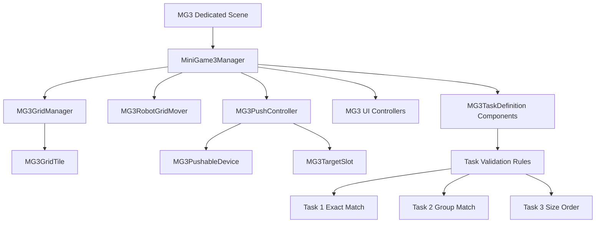

# Mini-Game 3 Training Signature Match Implementation Plan

## I. Executive Summary

**Goal**: Implement Mini-Game 3 as a dedicated top-down Unity puzzle scene where the robot right-click pathfinds on an invisible grid and pushes devices into task-specific target tiles.

**Success Metrics**:

- Mini-Game 3 runs in its own scene with zero Unity compile errors.
- The robot can right-click pathfind through empty grid tiles and push one object exactly one tile with `E`.
- The three fixed authored tasks complete linearly, reset correctly on object deadlock, and show a final result screen after Task 3.

## II. Skill Matrix

| Component | Required Skill | Implementation Role |
|-----------|----------------|---------------------|
| Planning and sequencing | `planner` | Defines dependency-safe implementation stages and verification procedures. |
| Push interaction | `unity-interaction` | Keeps push activation explicit through an interact input instead of automatic collision behavior. |
| Task and movement state flow | `unity-fsm` | Shapes the manager state model: waiting, pathfinding, moving, ready to push, pushing, settling, checking, resetting, completed. |
| Device and tile data | `unity-so-prefab-manager` | Uses lightweight data components on scene-authored objects while keeping runtime state independent per instance. |
| UI state updates | `unity-ui-data-binding` | Guides one-way UI updates from manager/task state to TMP/UGUI display fields. |

## III. Logic & Architecture

Project context found before planning:

- Input System is installed and already used by existing movement scripts.
- Cinemachine is installed and already used by the project.
- UGUI and TextMesh Pro are used for existing MG1/MG2 UI.
- Existing mini-games live under `Assets/Scripts/MiniGames/MiniGame1` and `Assets/Scripts/MiniGames/MiniGame2`.
- Existing MG2 has useful reference patterns: `GridManager`, `TileClickMover`, `MiniGame2Manager`, `MiniGame2RobotPovUI`, `MiniGame2ResultScreenUI`.
- There are no assembly definition files, so MG3 should follow the current project style and avoid asmdef work in this plan.

MG3 architecture should be isolated under `Assets/Scripts/MiniGames/MiniGame3` so MG2 is not modified or regressed.

Core movement interpretation to preserve:

- The scene floor may look continuous or discrete, but every valid robot/device position maps to an invisible grid coordinate.
- Right-click chooses a destination grid cell from the top-down camera raycast.
- The robot uses pathfinding through empty cells only.
- Objects are treated as hard pathfinding obstacles.
- The robot must path to an empty cell directly behind the object to push it.
- Pressing `E` commits a push if the robot is in a valid push position.
- The object moves one grid cell in the logical direction.
- Movement and pushing are non-interruptible once committed.

## IV. Phased Roadmap

## Stage 1: Scene and Folder Scaffolding
> **Entry Condition**: Current project opens in Unity and existing MG1/MG2 scripts remain untouched.
> **Exit Condition**: MG3 has a dedicated scene, script folder structure, and empty root GameObjects ready for wiring.

### Module 1.1: Asset Structure

- [ ] [P1.1.1] Create MG3 script folders: Create `Assets/Scripts/MiniGames/MiniGame3`, `Assets/Scripts/MiniGames/MiniGame3/UI`, and optional `Assets/Scripts/MiniGames/MiniGame3/Editor` if editor tooling is needed.
      depends_on: none
      Verify: Folders exist in the Unity Project view and no existing MG1/MG2 folders are modified.

- [ ] [P1.1.2] Create MG3 data folders: Create `Assets/Data/MiniGames/MiniGame3` for any future MG3 data assets.
      depends_on: none
      Verify: Folder exists and Unity generates `.meta` files.

- [ ] [P1.1.3] Create dedicated MG3 scene: Add a new scene named `Mini Game 3.unity` under an appropriate scenes folder, preferably `Assets/Scenes/Nour` or a new `Assets/Scenes/MiniGames` folder if the team wants all mini-games grouped.
      depends_on: P1.1.1
      Verify: Scene exists and opens without missing script warnings.

### Module 1.2: Scene Roots

- [ ] [P1.2.1] Add scene root objects: Create `MG3_Root`, `MG3_Grid`, `MG3_Tasks`, `MG3_UI`, and `MG3_Cameras` root GameObjects.
      depends_on: P1.1.3
      Verify: Scene hierarchy contains all five root objects.

- [ ] [P1.2.2] Add robot placeholder/reference: Place the robot prefab or scene robot at the MG3 start grid coordinate and ensure it has a `CharacterController` or movement-compatible transform root.
      depends_on: P1.2.1
      Verify: Robot is visible in scene and its starting world position maps cleanly to one grid cell.

- [ ] [P1.2.3] Configure top-down camera: Add a top-down Cinemachine camera similar to MG2, aimed at the robot/lab area, with cursor visible and no free-look requirement.
      depends_on: P1.2.2
      Verify: Enter Play Mode and observe a stable top-down view of the MG3 board.

### Stage 1 Test Procedures

#### Test 1.1: Dedicated Scene Opens
- **Type**: Manual
- **Preconditions**: Stage 1 tasks are complete.
- **Steps**:
  1. Open Unity.
  2. Open the new `Mini Game 3.unity` scene.
  3. Inspect the Console.
- **Expected Result**: Scene opens with no missing script warnings and no new compile errors.
- **Pass Command**: N/A
- **Fail Indicators**: Missing script warnings, red Console compile errors, absent MG3 root objects.

#### Test 1.2: Top-Down Camera View
- **Type**: Manual
- **Preconditions**: `MG3_Cameras` and robot placeholder are configured.
- **Steps**:
  1. Press Play in the MG3 scene.
  2. Observe the Game view.
- **Expected Result**: The robot and lab board are visible from a top-down camera angle.
- **Pass Command**: N/A
- **Fail Indicators**: Camera shows empty space, camera clips through geometry, robot is not visible.

## Stage 2: Core Grid and Coordinate System
> **Entry Condition**: MG3 scene exists with camera and robot roots.
> **Exit Condition**: MG3 has an isolated grid system that maps world positions to grid coordinates and marks occupied/blocked cells.

### Module 2.1: Grid Components

- [ ] [P2.1.1] Implement `MG3GridCoord`: Add a small serializable coordinate type or use `Vector2Int` consistently for grid positions.
      depends_on: P1.1.1
      Verify: Code compiles and all MG3 scripts can reference `Vector2Int` or the selected coordinate type consistently.

- [ ] [P2.1.2] Implement `MG3GridTile`: Create a scene-authored tile component with coordinate, walkable flag, optional deadlock marker note, and debug color settings.
      depends_on: P2.1.1
      Verify: Component can be added to floor tile GameObjects and exposes fields in the Inspector.

- [ ] [P2.1.3] Implement `MG3GridManager`: Build an isolated grid registry from scene `MG3GridTile` components and expose `WorldToGrid`, `GridToWorld`, `IsInBounds`, `IsWalkable`, and `TryGetTile`.
      depends_on: P2.1.2
      Verify: Manager logs detected tile count on Play Mode start with no null reference exceptions.

### Module 2.2: Occupancy

- [ ] [P2.2.1] Add runtime occupancy model: Track robot cell, pushable object cells, locked object cells, and blocked static obstacle cells.
      depends_on: P2.1.3
      Verify: Inspector/debug log can show occupied cells after Play Mode starts.

- [ ] [P2.2.2] Add occupancy refresh API: Implement methods to register/unregister/move pushable devices without relying on Rigidbody physics.
      depends_on: P2.2.1
      Verify: Moving a registered device updates its grid coordinate and frees the old coordinate.

- [ ] [P2.2.3] Add grid gizmos: Draw grid centers, blocked cells, occupied cells, and target slots with distinct debug colors.
      depends_on: P2.2.2
      Verify: Scene view shows grid debug visualization when gizmos are enabled.

### Stage 2 Test Procedures

#### Test 2.1: Grid Registry
- **Type**: Manual
- **Preconditions**: MG3 scene contains several `MG3GridTile` components and one `MG3GridManager`.
- **Steps**:
  1. Press Play.
  2. Inspect Console logs from `MG3GridManager`.
  3. Select `MG3GridManager` in the Inspector.
- **Expected Result**: The manager registers every authored grid tile exactly once and reports no duplicate coordinate errors.
- **Pass Command**: N/A
- **Fail Indicators**: Duplicate coordinate errors, tile count is zero, null reference exceptions.

#### Test 2.2: Occupancy Update
- **Type**: Manual
- **Preconditions**: At least one pushable object is registered on the grid.
- **Steps**:
  1. Press Play.
  2. Move the test device through a debug method or temporary Inspector button if added.
  3. Observe grid gizmos or Console output.
- **Expected Result**: The object's old coordinate becomes empty and the new coordinate becomes occupied.
- **Pass Command**: N/A
- **Fail Indicators**: Both old and new cells remain occupied, object coordinate does not update, occupancy allows two objects in one cell.

## Stage 3: Robot Right-Click Pathfinding Movement
> **Entry Condition**: Grid manager can resolve walkable and occupied cells.
> **Exit Condition**: Robot right-clicks to reachable empty cells using 4-direction pathfinding from the top-down camera.

### Module 3.1: Pathfinding

- [ ] [P3.1.1] Implement `MG3Pathfinder`: Add 4-direction A* or BFS pathfinding through empty walkable cells only.
      depends_on: P2.2.2
      Verify: Given a start and goal coordinate, pathfinder returns a list that contains no blocked or occupied cells.

- [ ] [P3.1.2] Reject unreachable destinations: Return failure when the goal is outside the grid, blocked, occupied, or disconnected.
      depends_on: P3.1.1
      Verify: Calling pathfinder on an occupied object cell returns failure.

### Module 3.2: Robot Mover

- [ ] [P3.2.1] Implement `MG3RobotGridMover`: Move the robot along path steps at a configurable speed and snap to cell centers at step completion.
      depends_on: P3.1.2
      Verify: Robot follows a provided path and ends exactly at the destination grid center.

- [ ] [P3.2.2] Add right-click input handling: Raycast from the top-down camera to floor, convert hit point to grid destination, request movement path.
      depends_on: P3.2.1
      Verify: Right-clicking a valid empty tile moves the robot there.

- [ ] [P3.2.3] Add movement lock: Ignore right-click requests while the robot is moving or while a push is running.
      depends_on: P3.2.2
      Verify: Right-clicking during movement does not queue a second movement.

- [ ] [P3.2.4] Add unreachable feedback event: Fire a manager/UI event when movement is refused.
      depends_on: P3.2.2
      Verify: Right-clicking a blocked destination emits one feedback event.

### Stage 3 Test Procedures

#### Test 3.1: Valid Right-Click Movement
- **Type**: Manual
- **Preconditions**: MG3 scene has a robot, grid manager, top-down camera, and `MG3RobotGridMover`.
- **Steps**:
  1. Press Play.
  2. Right-click an empty reachable tile three cells away.
  3. Wait for movement to finish.
- **Expected Result**: Robot pathfinds through empty cells only and stops centered on the clicked tile.
- **Pass Command**: N/A
- **Fail Indicators**: Robot moves diagonally, robot stops between cells, robot passes through an object cell.

#### Test 3.2: Unreachable Destination Feedback
- **Type**: Manual
- **Preconditions**: At least one blocked or occupied tile exists.
- **Steps**:
  1. Press Play.
  2. Right-click an occupied object tile.
  3. Observe UI/log feedback.
- **Expected Result**: Robot does not move and feedback indicates the destination is unreachable.
- **Pass Command**: N/A
- **Fail Indicators**: Robot attempts to enter the occupied cell, no feedback appears, movement queue receives invalid steps.

## Stage 4: Pushable Devices and Explicit Interaction
> **Entry Condition**: Robot movement and occupancy are reliable.
> **Exit Condition**: Robot can press `E` from a valid push position to push exactly one object exactly one tile.

### Module 4.1: Device Data Components

- [ ] [P4.1.1] Implement `MG3PushableDevice`: Add fields for device ID, group ID, size rank, current coordinate, starting coordinate, locked state, and visual reference.
      depends_on: P2.2.2
      Verify: Component is assignable to device prefabs/scene objects and registers with the grid on start.

- [ ] [P4.1.2] Implement device reset API: Restore device position, coordinate, locked state, and occupancy to task-start values.
      depends_on: P4.1.1
      Verify: Calling reset returns a moved device to its authored task start position.

### Module 4.2: Push Controller

- [ ] [P4.2.1] Implement `MG3PushController`: Detect whether the robot is directly adjacent to one pushable device and compute push direction from robot position to object position.
      depends_on: P4.1.1, P3.2.1
      Verify: Controller reports valid push only when robot is directly behind an unlocked device.

- [ ] [P4.2.2] Bind `E` interact input: Push only when the player presses `E`; do not auto-push from collision or arrival.
      depends_on: P4.2.1
      Verify: Standing behind an object does nothing until `E` is pressed.

- [ ] [P4.2.3] Validate target cell before push: Reject push if the destination cell is occupied by another object, locked object, wall, or out of bounds.
      depends_on: P4.2.2
      Verify: Pushing into another object does not move either object.

- [ ] [P4.2.4] Animate push as one committed cell step: Move object from source cell to target cell, lock robot movement during the push, then snap object to target cell.
      depends_on: P4.2.3
      Verify: Object moves one cell and only one cell per `E` press.

- [ ] [P4.2.5] Add push completion event: Notify `MiniGame3Manager` when a push finishes so validation can run after settling.
      depends_on: P4.2.4
      Verify: Manager receives exactly one event per completed push.

### Stage 4 Test Procedures

#### Test 4.1: Valid Single Push
- **Type**: Manual
- **Preconditions**: Robot starts adjacent to an unlocked object with an empty cell ahead of it.
- **Steps**:
  1. Press Play.
  2. Press `E` once.
  3. Wait for push movement to complete.
- **Expected Result**: Object moves exactly one cell away from the robot, robot input is locked during the push, and no second object moves.
- **Pass Command**: N/A
- **Fail Indicators**: Object slides more than one cell, object moves diagonally, robot accepts movement during push.

#### Test 4.2: Blocked Push Rejection
- **Type**: Manual
- **Preconditions**: Object has another object or wall in its target push cell.
- **Steps**:
  1. Press Play.
  2. Position robot behind the blocked object.
  3. Press `E`.
- **Expected Result**: Push is refused, both objects remain in their original cells, and feedback is shown.
- **Pass Command**: N/A
- **Fail Indicators**: Chain push occurs, objects overlap, occupancy changes despite rejected push.

## Stage 5: Task System and Validation Rules
> **Entry Condition**: Devices can be moved deterministically on the grid.
> **Exit Condition**: The three fixed tasks validate exact match, group match, and size ordering correctly.

### Module 5.1: Task Data

- [ ] [P5.1.1] Implement `MG3TaskType`: Define task types `ExactPlacement`, `GroupPlacement`, and `SizeOrdering`.
      depends_on: P1.1.1
      Verify: Enum compiles and is referenced by task components.

- [ ] [P5.1.2] Implement `MG3TargetSlot`: Add fields for coordinate, required device ID, required group ID, size order index, lit/solved state, and visual indicator references.
      depends_on: P2.1.2
      Verify: Component is assignable to target tile objects and exposes matching fields.

- [ ] [P5.1.3] Implement `MG3TaskDefinition`: Scene-authored component containing task name, instructions, task type, devices, slots, robot start coordinate, and optional UI references.
      depends_on: P5.1.1, P5.1.2, P4.1.1
      Verify: Three task components can be configured in the MG3 scene.

### Module 5.2: Validation

- [ ] [P5.2.1] Implement exact placement validation: A slot turns green only when the matching device ID occupies its coordinate.
      depends_on: P5.1.3
      Verify: Wrong device on a slot leaves it unlit; correct device lights it.

- [ ] [P5.2.2] Implement group placement validation: Any device with the required group ID can satisfy any group slot.
      depends_on: P5.2.1
      Verify: Swapping two same-group devices across group slots still passes.

- [ ] [P5.2.3] Implement size ordering validation: Slots validate the expected size rank/order index for Task 3.
      depends_on: P5.2.2
      Verify: Task 3 only passes when the authored size order is correct.

- [ ] [P5.2.4] Add all-at-once completion check: Complete a task only when every required slot is valid simultaneously after all objects are stationary.
      depends_on: P5.2.3
      Verify: A task does not complete if only one of multiple slots is valid.

- [ ] [P5.2.5] Lock solved devices: When a task completes, lock correct devices in place and keep them as physical/occupancy blockers.
      depends_on: P5.2.4
      Verify: Solved devices cannot be pushed after task completion.

### Stage 5 Test Procedures

#### Test 5.1: Wrong Object Does Not Solve
- **Type**: Manual
- **Preconditions**: Task 1 has at least two devices and two exact target slots.
- **Steps**:
  1. Press Play.
  2. Push Device A onto Device B's slot.
  3. Wait for settling.
- **Expected Result**: The slot remains unlit, the task does not complete, and Device A remains movable.
- **Pass Command**: N/A
- **Fail Indicators**: Slot lights green, device locks incorrectly, task completes early.

#### Test 5.2: All Slots Complete Together
- **Type**: Manual
- **Preconditions**: Current task requires multiple correct placements.
- **Steps**:
  1. Solve only one required slot.
  2. Wait for settling.
  3. Solve all remaining required slots.
- **Expected Result**: Task does not complete after the first slot, then completes only after all required slots are correct at the same time.
- **Pass Command**: N/A
- **Fail Indicators**: Task completes incrementally, task completes before all slots are correct, slot state desyncs after movement.

## Stage 6: MiniGame3 Manager, State Flow, and Reset
> **Entry Condition**: Task validation can identify solved and unsolved layouts.
> **Exit Condition**: MiniGame3 runs Task 1 -> Task 2 -> Task 3, handles deadlocks, and resets current task cleanly.

### Module 6.1: Manager State Machine

- [ ] [P6.1.1] Implement `MiniGame3Phase`: Define `Idle`, `TaskIntro`, `WaitingForInput`, `Pathfinding`, `Moving`, `ReadyToPush`, `Pushing`, `Settling`, `CheckingCompletion`, `Resetting`, `Completed`.
      depends_on: P5.1.3
      Verify: Enum compiles and manager can expose current phase.

- [ ] [P6.1.2] Implement `MiniGame3Manager`: Own task list, current task index, phase transitions, events, and auto-start on scene load.
      depends_on: P6.1.1, P3.2.4, P4.2.5, P5.2.4
      Verify: Play Mode starts Task 1 automatically.

- [ ] [P6.1.3] Add short settle delay: After movement or push completion, wait a configurable delay before validation.
      depends_on: P6.1.2
      Verify: Validation logs occur after the settle delay, not during movement.

- [ ] [P6.1.4] Add task advance flow: Show completion popup briefly, then start the next task instantly.
      depends_on: P6.1.3
      Verify: Completing Task 1 transitions to Task 2 without player confirmation.

### Module 6.2: Deadlock and Reset

- [ ] [P6.2.1] Implement deadlock detection: After an object moves, detect if that object cannot be moved in any of the four directions because every push setup or destination is impossible.
      depends_on: P4.2.5, P6.1.3
      Verify: A deliberately boxed-in object triggers deadlock detection.

- [ ] [P6.2.2] Add deadlock fail popup event: Notify UI that a deadlock happened before reset.
      depends_on: P6.2.1
      Verify: Deadlock emits one fail popup event.

- [ ] [P6.2.3] Implement full current-task reset: Restore robot position, task devices, slot visuals, occupancy, UI text, and phase state.
      depends_on: P6.2.2, P4.1.2
      Verify: After reset, current task matches its initial authored state.

- [ ] [P6.2.4] Ensure no hard fail state: Reset returns the player to the same task without final failure or score penalty.
      depends_on: P6.2.3
      Verify: Deadlock does not move to final result screen and does not end the mini-game.

### Stage 6 Test Procedures

#### Test 6.1: Linear Task Progression
- **Type**: Manual
- **Preconditions**: Three task definitions exist and are configured in manager order.
- **Steps**:
  1. Press Play.
  2. Complete Task 1.
  3. Observe popup and next task.
  4. Complete Task 2.
  5. Observe popup and Task 3 start.
- **Expected Result**: Tasks advance strictly in order and no task can be skipped.
- **Pass Command**: N/A
- **Fail Indicators**: Task order changes unexpectedly, next task requires manual confirmation, manager remains stuck in `CheckingCompletion`.

#### Test 6.2: Deadlock Full Reset
- **Type**: Manual
- **Preconditions**: A test layout contains a reachable deadlock position for an object.
- **Steps**:
  1. Press Play.
  2. Push an object into the known deadlock position.
  3. Wait for fail popup and reset.
- **Expected Result**: A short fail popup appears, then robot/object/slot/UI state returns to the current task's initial state.
- **Pass Command**: N/A
- **Fail Indicators**: Only the object resets, partial slot progress remains, robot stays in deadlocked location, final result screen appears.

## Stage 7: UI and Final Result Screen
> **Entry Condition**: Manager emits phase, task, completion, reset, and final completion events.
> **Exit Condition**: Player sees instructions, target layout, feedback, task completion popups, deadlock popups, and final result screen.

### Module 7.1: Runtime HUD

- [ ] [P7.1.1] Implement `MiniGame3RobotPovUI`: Subscribe to `MiniGame3Manager` events and display task name, instructions, push prompt, unreachable feedback, and current phase.
      depends_on: P6.1.2
      Verify: UI updates when Task 1 starts.

- [ ] [P7.1.2] Display full target layout: Add UI text/icons or scene-linked references that show the full target layout up front for each task.
      depends_on: P7.1.1, P5.1.3
      Verify: Starting each task updates the displayed target layout.

- [ ] [P7.1.3] Add contextual push prompt: Show prompt only when the robot is in a valid push position behind an unlocked object.
      depends_on: P7.1.1, P4.2.1
      Verify: Prompt appears behind a pushable object and disappears elsewhere.

- [ ] [P7.1.4] Add completion and fail popups: Implement brief popup display for task completion and deadlock reset.
      depends_on: P6.1.4, P6.2.2
      Verify: Correct popup appears for task completion and deadlock.

### Module 7.2: Final Result

- [ ] [P7.2.1] Implement `MiniGame3ResultScreenUI`: Show after Task 3 completes with basic completion summary and reset count if tracked.
      depends_on: P6.1.4
      Verify: Final screen appears only after Task 3.

- [ ] [P7.2.2] Add result buttons: Add retry/restart button for MG3 and optional continue/close button for future world-flow integration.
      depends_on: P7.2.1
      Verify: Retry restarts Task 1 from a clean state.

### Stage 7 Test Procedures

#### Test 7.1: HUD Feedback
- **Type**: Manual
- **Preconditions**: HUD is assigned to manager events.
- **Steps**:
  1. Press Play.
  2. Start Task 1.
  3. Right-click an unreachable tile.
  4. Move behind an object.
- **Expected Result**: Task instructions are visible, unreachable feedback appears after invalid click, and push prompt appears only in valid push position.
- **Pass Command**: N/A
- **Fail Indicators**: UI remains blank, prompt is always visible, invalid movement has no feedback.

#### Test 7.2: Final Result After Task 3
- **Type**: Manual
- **Preconditions**: All three tasks are solvable.
- **Steps**:
  1. Press Play.
  2. Complete Task 1.
  3. Complete Task 2.
  4. Complete Task 3.
- **Expected Result**: Final result screen appears only after Task 3, not after Task 1 or Task 2.
- **Pass Command**: N/A
- **Fail Indicators**: Final screen appears early, final screen never appears, controls remain active behind the final screen when they should be locked.

## Stage 8: Level Authoring and Integration Hardening
> **Entry Condition**: MG3 mechanics and UI are implemented.
> **Exit Condition**: The dedicated MG3 scene has authored Task 1, Task 2, and Task 3 layouts that are manually solvable and do not regress MG2.

### Module 8.1: Authored Layouts

- [ ] [P8.1.1] Author Task 1 layout: Place exact-match devices and slots in the scene with at least three devices.
      depends_on: P5.2.1, P6.1.2
      Verify: Task 1 is solvable manually and wrong placements do not solve.

- [ ] [P8.1.2] Author Task 2 layout: Place group-match devices and slots in the scene with at least four devices.
      depends_on: P5.2.2, P8.1.1
      Verify: Task 2 accepts any correct group device on the correct group slots.

- [ ] [P8.1.3] Author Task 3 layout: Place size-order devices and slots in the scene with clear right-to-left or authored order markers.
      depends_on: P5.2.3, P8.1.2
      Verify: Task 3 validates only the intended size order.

- [ ] [P8.1.4] Add deadlock scenarios intentionally: Add deadlock-prone cells only where the puzzle logic is readable and reset behavior is acceptable.
      depends_on: P6.2.3, P8.1.3
      Verify: At least one deadlock reset path is testable without breaking normal solution routes.

### Module 8.2: Control and Regression Checks

- [ ] [P8.2.1] Disable normal WASD robot movement while MG3 is active: Follow MG2's pattern of disabling `RobotMovement` during the mini-game.
      depends_on: P6.1.2
      Verify: WASD does not move the robot in MG3, but right-click movement works.

- [ ] [P8.2.2] Keep MG2 untouched: Ensure MG3 uses isolated scripts and does not modify `MiniGame2Manager`, `GridManager`, or `TileClickMover` unless separately approved.
      depends_on: P8.2.1
      Verify: Git diff shows no MG2 script changes for MG3 implementation.

- [ ] [P8.2.3] Add editor/inspector validation logs: Warn on duplicate grid coordinates, missing slot references, missing device IDs, unreachable task starts, and overlapping start positions.
      depends_on: P8.1.4
      Verify: Deliberately misconfigured scene emits clear warnings without crashing.

### Stage 8 Test Procedures

#### Test 8.1: Full Manual Playthrough
- **Type**: E2E Manual
- **Preconditions**: MG3 scene has all tasks, UI, robot, top-down camera, and controls wired.
- **Steps**:
  1. Open the MG3 scene.
  2. Press Play.
  3. Complete Task 1 using right-click movement and `E` pushes.
  4. Complete Task 2 using right-click movement and `E` pushes.
  5. Complete Task 3 using right-click movement and `E` pushes.
- **Expected Result**: All tasks complete in order, each completion popup appears briefly, and the final result screen appears after Task 3.
- **Pass Command**: N/A
- **Fail Indicators**: Robot passes through objects, push moves more than one tile, task validation is wrong, final screen does not appear.

#### Test 8.2: MG2 Regression Smoke Test
- **Type**: Manual
- **Preconditions**: MG3 implementation is complete and MG2 scripts are expected to be untouched.
- **Steps**:
  1. Open `Assets/Scenes/Oraby/Second MiniGame.unity`.
  2. Press Play.
  3. Run the existing MG2 movement flow enough to confirm click movement still works.
- **Expected Result**: MG2 behaves as before and has no new compile/runtime errors caused by MG3.
- **Pass Command**: N/A
- **Fail Indicators**: MG2 click movement is broken, MG2 manager errors appear, MG2 scene has missing scripts from MG3 changes.

#### Test 8.3: Build Compile Check
- **Type**: Manual
- **Preconditions**: All code stages are complete.
- **Steps**:
  1. Open Unity.
  2. Wait for scripts to compile.
  3. Inspect Console.
- **Expected Result**: No red compile errors are present.
- **Pass Command**: N/A
- **Fail Indicators**: C# compile errors, missing namespace errors, missing serialized type warnings.

## V. Final Verification Checklist

- [ ] MG3 has a dedicated scene and auto-starts when the scene loads.
- [ ] Camera is top-down like MG2.
- [ ] Right-click movement works through pathfinding on empty grid cells only.
- [ ] Movement is 4-direction only.
- [ ] Objects block robot movement and pathfinding.
- [ ] `E` pushes only when the robot is directly behind one unlocked object.
- [ ] Each push moves exactly one object exactly one cell.
- [ ] Pushes are committed and cannot be interrupted.
- [ ] Wrong object on a target tile does not turn the tile green.
- [ ] Correct object locks in place and remains a physical obstacle.
- [ ] Task 1 validates exact device-to-slot match.
- [ ] Task 2 validates group matching.
- [ ] Task 3 validates size ordering.
- [ ] Completion checks only after movement stops and a short settle delay passes.
- [ ] Task completion requires all required placements correct at the same time.
- [ ] Deadlock affects pushed objects only.
- [ ] Deadlock shows a short fail popup and fully resets the current task.
- [ ] There is no hard fail state and no stat progression update.
- [ ] Task 1, Task 2, and Task 3 advance strictly in order.
- [ ] Final result screen appears after Task 3 only.
- [ ] MG2 scripts and behavior are not modified or regressed.
